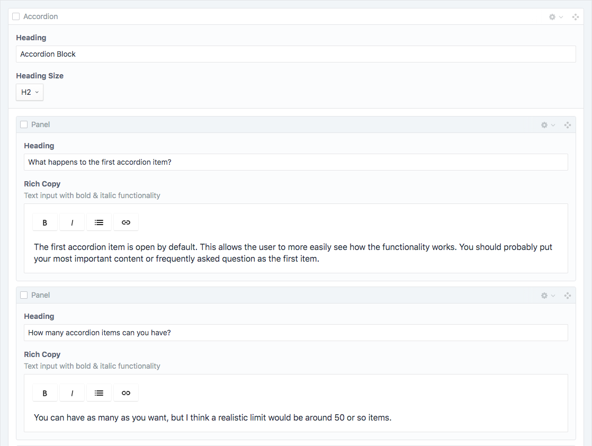
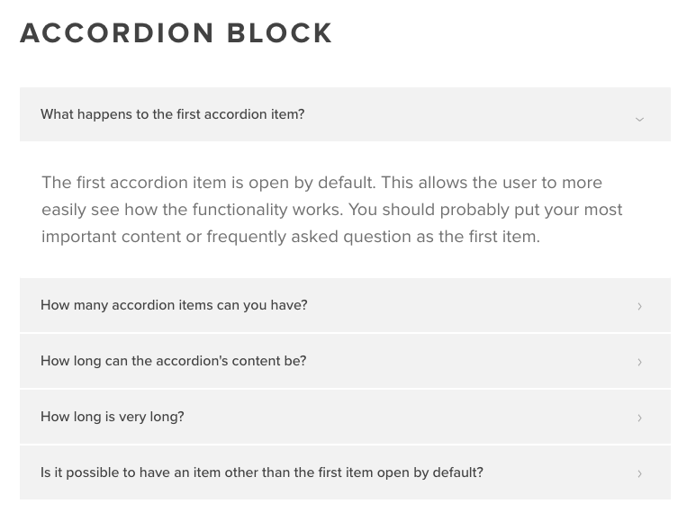

# Accordion
Accordion block allows you to add stacked content that is closable as you would expect form an accordion.  You have a heading input and a rich text input for the accordion copy. The rich text input allows for bold, italic, lists, and links.

### Heading Sizes
`Extra Large (h1)` `Large (h2)` `Medium (h3)` `Small (h4)` `Standard (h5)`

### Input

### Output

