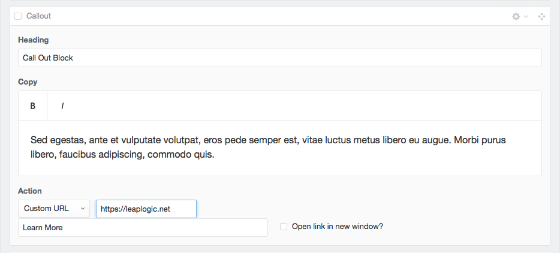
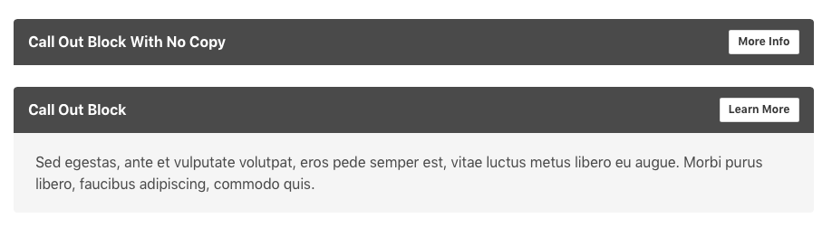

# Callout
The Callout block is a section of content to highlight a block of text, heading and action link(s). The section can output with no copy just to highlight the heading and action link(s). In addition you have the option to change the background color, add a background image and toggle the text from light to dark depending on the image or background color choosen.

### Input

### Output
