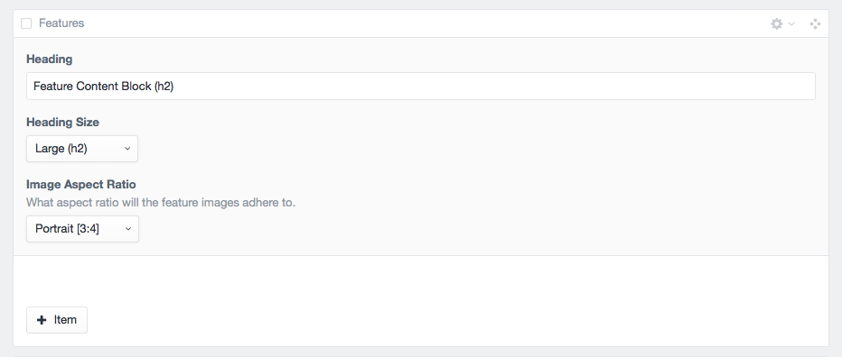
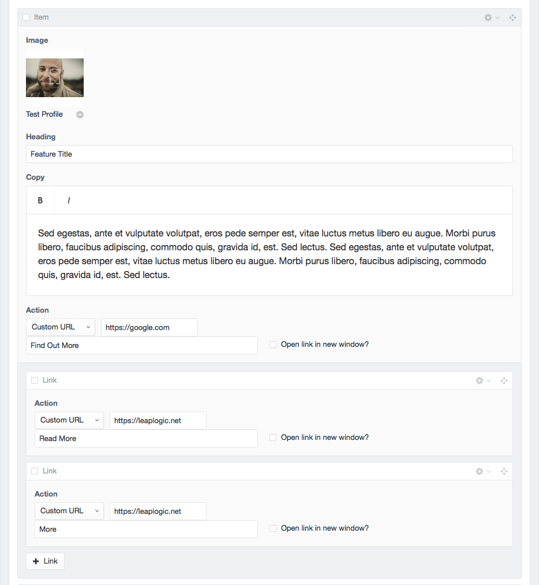
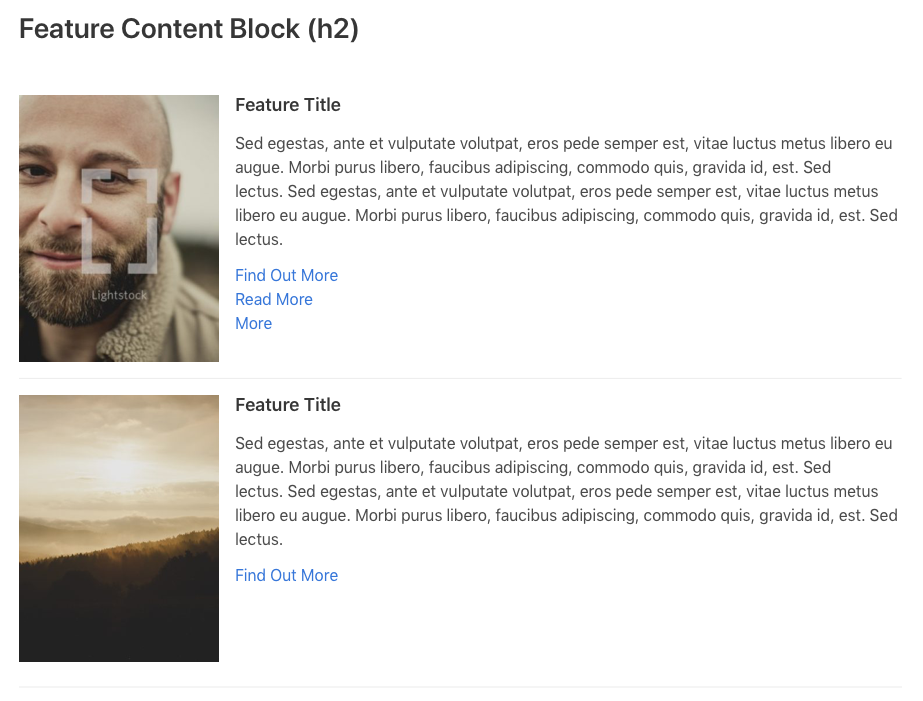
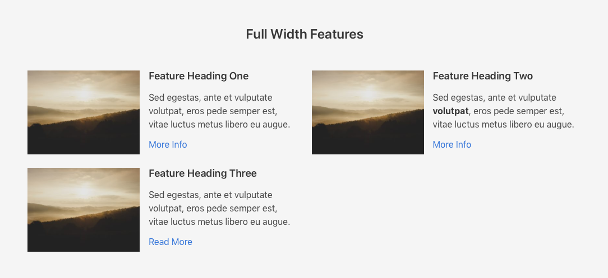

# Features
Features allows for a heading for the section and ability to edit the heading size.  In addition you can specify the specific aspect ratio you would like the feautred images to adhere to. There is no limit to the amount of feature items.  

Each feature item has an image, heading, copy, and action link.  In addition you can add additional action links via the `link` button.  These additional action links will provide a list along with the featured item's default action link.

### Heading Sizes
`Extra Large (h1)` `Large (h2)` `Medium (h3)` `Small (h4)` `Standard (h5)`
### Image Aspect Ratios
`Landscape [4:3]` `Portrait [3:4]` `Icon [1:1]`
> *The Icon size max width is 64x64 px*

### Input

### Input Item

### Output

**Full Width**
