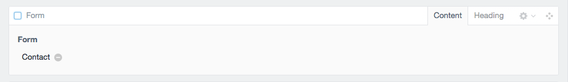
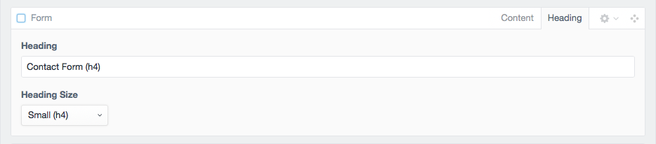
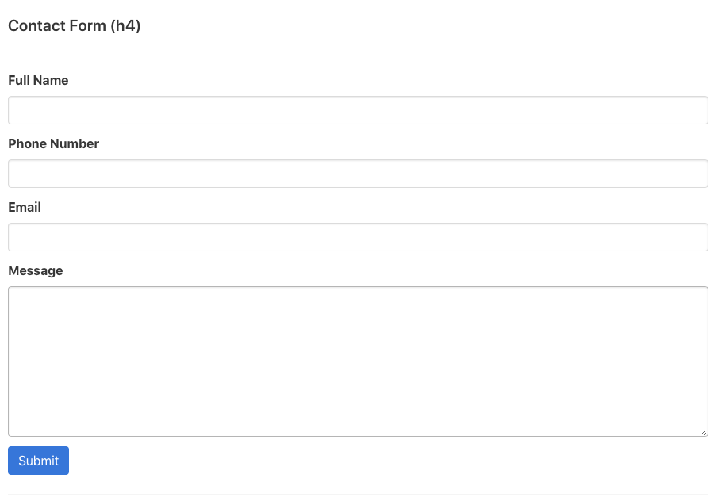

# Form
The form block allows you to select a form from the plugin Sprout Forms.  So you will first need to have forms created there. Using Sprout Forms interface when you place your inputs within tabs on the front end this will output the the inputs in those tabs horizontally next to one another if that design ability is desired.

### Input

### Input Heading

### Output
