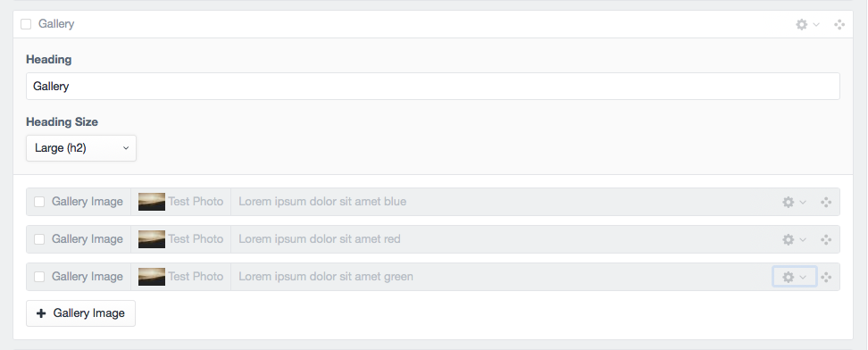
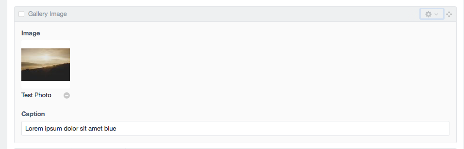
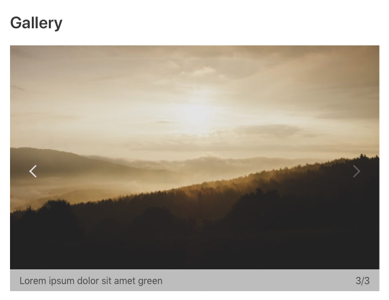

# Gallery
Gallery provides an image gallery output. The gallery section can have a heading with selected heading size. Each gallery image has a caption input which is optional. The gallery will appear in a responsive slider. If a gallery image is clicked it will open the slider in larger full screen modal for focused viewing. 

### Images Sizes
Image transforms are applied to optimize the image sizes.
* Page Slider `883w 588h`
* Modal Slider `1200w 900h`

### Input

### Input Item

### Output

