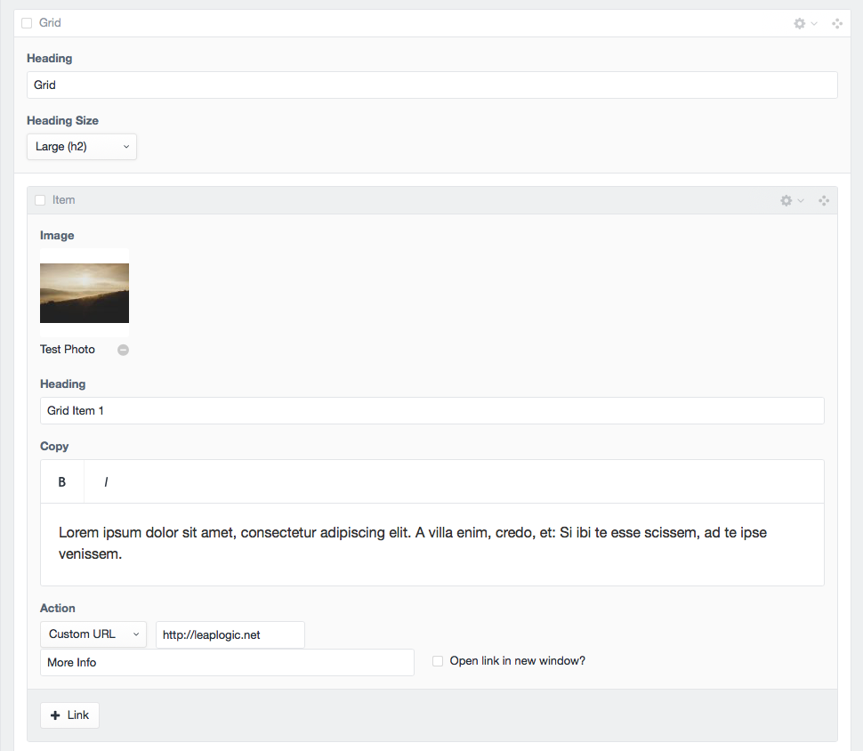
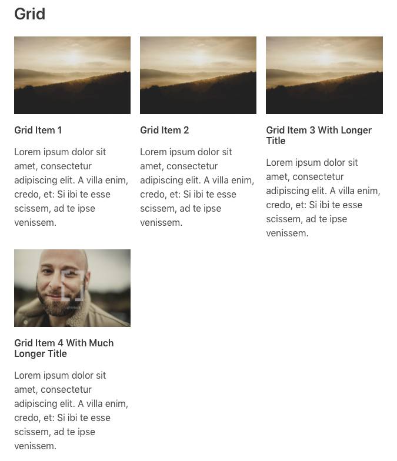
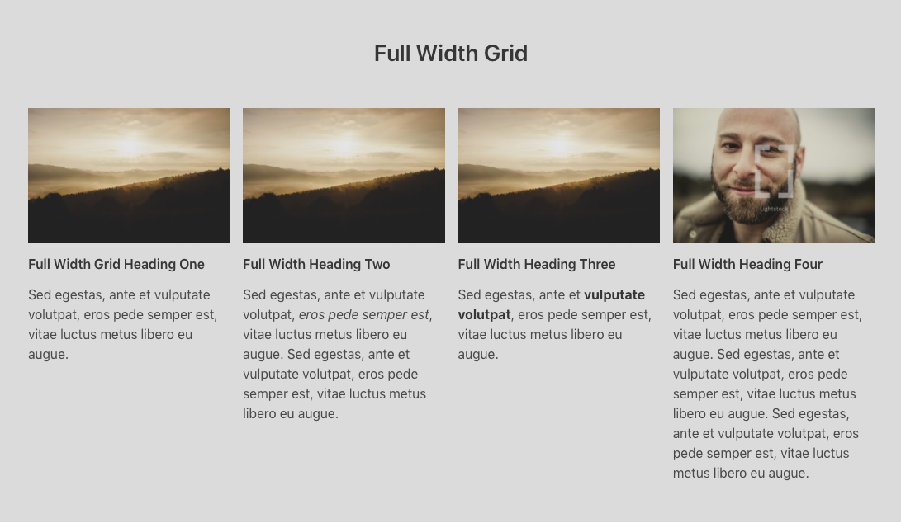

# Grid
Grid is simliar to features except with a different layout.  Images are above content.  Like features each grid item has a heading, image, copy, action link and ability to add additional action links. You can add unlimited grid items to your grid block. Images adhear to a specific aspect ratio `[4:3]` and have an image transform `645x430`.

### Input

### Output

**Full Width**
