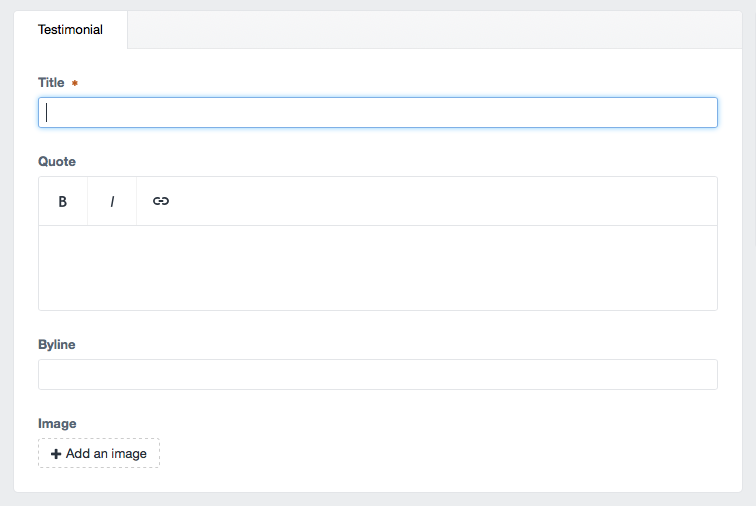

# Testimonials
Testimonials has its own Section in Craft CMS.  The first item would be to create entries in the testimonials section. From there in the content page block you will just select the entries you want.  On output if there are more than one testimonial it will show apply a slider components so the users can paginate through each testimonial.  If there is only one testimonial it will show it without slider controls.

### Input
**Testimonials Section Entry**

**Page Content Block**

### Output
