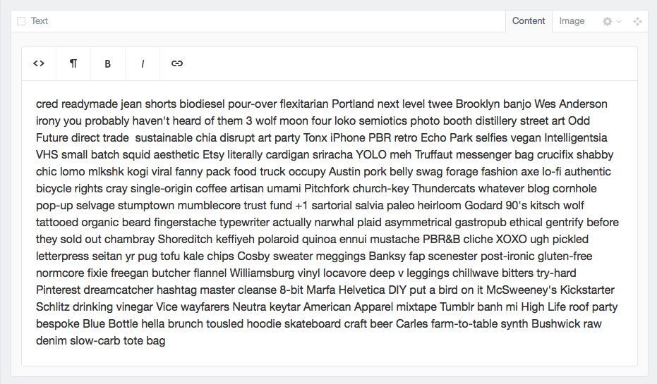
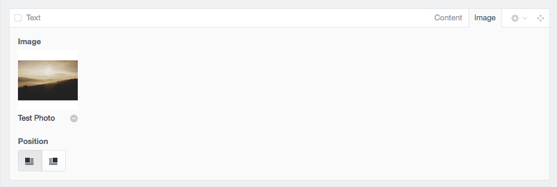
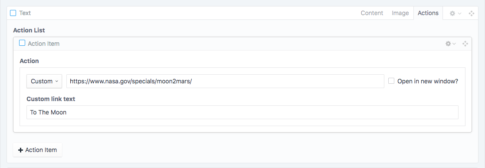

# Text

### Content Tab
The text block is a rich text block with several formatting options provided by the WYSIWYG. 

### Image Tab
We have provided the ability to add an image with positioning options to align right or left at the top of the available text.

### Actions Tab
We have provided the ability to add multiple actuib links styled as buttons which will be placed under any copy added in the Content Tab. 

